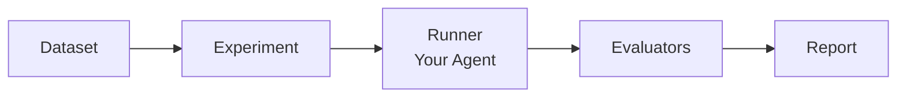

<div align="center">


# Cobalt

**Jest for AI Agents** — Test, evaluate, and improve your AI systems.


[](https://www.npmjs.com/package/@basalt-ai/cobalt)
[](https://opensource.org/licenses/MIT)
[](https://www.typescriptlang.org/)
[](https://nodejs.org/)

**Works with** &nbsp; [Langfuse](https://langfuse.com) · [LangSmith](https://smith.langchain.com) · [Braintrust](https://www.braintrust.dev) · [Basalt](https://basalt.ai)

<!-- TODO: Add demo GIF -->

</div>

---

## Table of Contents

- [Why Cobalt](#why-cobalt)
- [Quickstart](#quickstart)
- [Core Concepts](#core-concepts)
- [AI-First](#ai-first)
- [Integrations](#integrations)
- [Configuration](#configuration)
- [Roadmap](#roadmap)
- [Contributing](#contributing)
- [Community](#community)
- [License](#license)

## Why Cobalt

Cobalt is a TypeScript testing framework built for AI agents and LLM-powered applications. Define datasets, run your agent, and evaluate outputs with LLM judges, custom functions, or pre-built evaluators — all from the command line. Results are tracked in SQLite with built-in comparison tools, cost estimation, and CI/CD quality gates. Cobalt ships with an MCP server so AI coding assistants can run experiments and improve your agents directly.

## Quickstart

```bash
npm install @basalt-ai/cobalt
npx cobalt init
```

Create `experiments/my-agent.cobalt.ts`:

```typescript
import { experiment, Dataset, Evaluator } from '@basalt-ai/cobalt'

await experiment(
  'qa-agent',
  new Dataset({ items: [
    { input: 'What is 2+2?', expectedOutput: '4' },
    { input: 'Capital of France?', expectedOutput: 'Paris' },
  ]}),
  async ({ item }) => {
    const result = await myAgent(item.input)
    return { output: result }
  },
  {
    evaluators: [
      new Evaluator({
        name: 'Correctness',
        type: 'llm-judge',
        prompt: 'Is the output correct?\nExpected: {{expectedOutput}}\nActual: {{output}}',
      }),
    ],
  },
)
```

```bash
npx cobalt run experiments/my-agent.cobalt.ts
```

## Core Concepts



**Dataset** — Test data loaded from JSON, JSONL, CSV, inline objects, or remote platforms. Chainable transformations: `filter()`, `map()`, `sample()`, `slice()`. → [Docs](docs/datasets.md)

**Evaluator** — Scores your agent's output. Four built-in types: LLM judge (boolean/scale), custom functions, semantic similarity, and Autoevals (11 types from Braintrust). → [Docs](docs/evaluators.md)

**Experiment** — Runs your agent against a dataset, evaluates every output, and produces a report with per-evaluator statistics (avg, min, max, p50, p95). Supports parallel execution, multiple runs, timeout, and CI thresholds. → [Docs](docs/experiments.md)

## AI-First

Cobalt is designed to work with AI coding assistants out of the box.

### MCP Server

The built-in [MCP](https://modelcontextprotocol.io/) server gives Claude Code (and other MCP clients) direct access to your experiments:

```json
{
  "mcpServers": {
    "cobalt": {
      "command": "npx",
      "args": ["cobalt", "mcp"]
    }
  }
}
```

| Tools | Resources | Prompts |
|-------|-----------|---------|
| `cobalt_run` — Run experiments | `cobalt://config` — Current config | `improve-agent` — Analyze failures |
| `cobalt_results` — View results | `cobalt://experiments` — List experiments | `generate-tests` — Add test cases |
| `cobalt_compare` — Diff two runs | `cobalt://latest-results` — Latest results | `regression-check` — Detect regressions |
| `cobalt_generate` — Generate experiments | | |

→ [MCP Docs](docs/mcp.md)

### Skills

`cobalt init` generates a `.cobalt/SKILLS.md` file and integrates with your AI instruction files (`CLAUDE.md`, `AGENTS.md`, `.github/copilot-instructions.md`). → [Skills Docs](docs/skills.md)

### Example Prompts

> "Run my QA experiment and tell me which test cases are failing"
>
> "Generate a Cobalt experiment for my agent at `src/agents/summarizer.ts`"
>
> "Compare my last two runs and check for regressions"

## Integrations

Load datasets from your existing evaluation platforms:

| Platform | Loader | Docs |
|----------|--------|------|
| **Langfuse** | `await Dataset.fromLangfuse('dataset-name')` | [Setup](docs/integrations/langfuse.md) |
| **LangSmith** | `await Dataset.fromLangsmith('dataset-name')` | [Setup](docs/integrations/langsmith.md) |
| **Braintrust** | `await Dataset.fromBraintrust('project', 'dataset')` | [Setup](docs/integrations/braintrust.md) |
| **Basalt** | `await Dataset.fromBasalt('dataset-id')` | [Setup](docs/integrations/basalt.md) |

File formats: JSON, JSONL, CSV, HTTP/HTTPS remote URLs.

LLM providers: [OpenAI and Anthropic](docs/providers.md) (auto-detected from model name).

## Configuration

```typescript
// cobalt.config.ts
import { defineConfig } from '@basalt-ai/cobalt'

export default defineConfig({
  testDir: './experiments',
  judge: { model: 'gpt-4o-mini', provider: 'openai' },
  concurrency: 5,
  timeout: 30_000,
  cache: { enabled: true, ttl: '7d' },
})
```

| Option | Default | Description |
|--------|---------|-------------|
| `testDir` | `'./experiments'` | Experiment file directory |
| `judge.model` | `'gpt-4o-mini'` | Default LLM judge model |
| `concurrency` | `5` | Max parallel executions |
| `timeout` | `30000` | Per-item timeout (ms) |
| `reporters` | `['cli', 'json']` | Output reporters |
| `cache.ttl` | `'7d'` | LLM response cache TTL |
| `plugins` | `[]` | Custom evaluator plugins |
| `thresholds` | -- | CI quality gates |

→ [Full Configuration Reference](docs/configuration.md)

### CI/CD

```bash
npx cobalt run experiments/ --ci
# Exit code 1 if any threshold is violated
```

```yaml
# .github/workflows/test-agent.yml
- name: Run AI Tests
  run: npx cobalt run experiments/ --ci
  env:
    OPENAI_API_KEY: ${{ secrets.OPENAI_API_KEY }}
```

## CLI

```bash
cobalt run <file|dir>          # Run experiments
cobalt init                    # Initialize project
cobalt history                 # View past runs
cobalt compare <id1> <id2>     # Compare two runs
cobalt serve                   # Start dashboard
cobalt clean                   # Clean cache/results
cobalt mcp                     # Start MCP server
```

## Roadmap

<!-- TODO: Add link to GitHub Discussions -->

- [x] Core experiment runner with parallel execution
- [x] LLM judge evaluators (OpenAI & Anthropic, boolean/scale, chain of thought)
- [x] Custom function evaluators
- [x] Dataset loading (JSON, JSONL, CSV, remote platforms)
- [x] CI mode with quality thresholds
- [x] Plugin system with Autoevals integration
- [x] MCP server (4 tools, 3 resources, 3 prompts)
- [x] Auto-generate experiments from agent code
- [x] Statistical aggregations (avg, min, max, p50, p95, p99)
- [x] Dashboard backend API
- [ ] Dashboard frontend UI
- [ ] Similarity evaluator with embeddings
- [ ] GitHub Actions reporter
- [ ] VS Code extension

## Contributing

We welcome contributions! See our **[Contributing Guide](CONTRIBUTING.md)** for development setup, code standards, and PR process.

- **Report bugs**: [Open an issue](https://github.com/basalt-ai/cobalt/issues)
- **Suggest features**: [GitHub Issues](https://github.com/basalt-ai/cobalt/issues)
- **Create plugins**: Extend Cobalt with custom evaluators ([Plugin docs](docs/plugins.md))

## Community

- [Discord](https://discord.gg/yW2RyZKY)
- [GitHub Issues](https://github.com/basalt-ai/cobalt/issues)

## License

MIT — see [LICENSE](LICENSE) for details.
